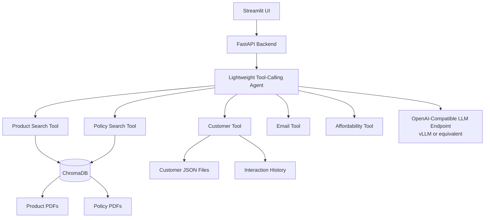

# Retail Banking Advisor Copilot

Retail Banking Advisor Copilot is a complete local demo of an enterprise AI assistant for retail banking advisors. It runs with a Streamlit UI, FastAPI backend, local JSON/PDF demo data, ChromaDB retrieval, deterministic banking tools, and an OpenAI-compatible LLM interface suitable for private vLLM deployments.

All customer profiles, product brochures, policies, and interaction histories are fictional and generated by scripts with fixed random seeds.

## Architecture



## What It Demonstrates

- Retrieval-Augmented Generation over product and policy PDFs
- OpenAI-compatible function/tool calling
- Customer profile and interaction analysis
- Product recommendations grounded in generated brochures
- Policy and compliance lookup with citations
- Professional follow-up email drafting
- Deterministic affordability assessment
- Fully local operation with no authentication, authorization, SSO, RBAC, user management, or external SaaS dependency

If the configured LLM endpoint is unavailable, the backend uses a deterministic fallback response path while still calling the same local tools. This keeps the demo usable in offline environments and makes vLLM optional for first-run validation.

## Project Structure

```text
app/
  api/
  agent/
  rag/
  tools/
  models/
  services/
  config/
frontend/
scripts/
data/
chroma_db/
Dockerfile
docker-compose.yml
requirements.txt
.env.example
startup.sh
README.md
```

## Local Development

```bash
python3.11 -m venv .venv
source .venv/bin/activate
pip install -r requirements.txt
cp .env.example .env
python scripts/generate_demo_data.py
python scripts/ingest_documents.py
uvicorn app.main:app --host 0.0.0.0 --port 8080
```

In another terminal:

```bash
source .venv/bin/activate
streamlit run frontend/streamlit_app.py --server.port 8501
```

Open:

- Streamlit: `http://localhost:8501`
- FastAPI OpenAPI docs: `http://localhost:8080/docs`

## Docker Deployment

```bash
docker compose up --build
```

The container startup script checks for generated data, creates it when missing, checks for ChromaDB indexes, ingests documents when needed, starts FastAPI on port `8080`, and starts Streamlit on port `8501`.

The compose file persists:

- `demo_data` at `/app/data`
- `chroma_data` at `/app/chroma_db`

## Helm Deployment

The Helm chart is in `charts/retail-banking-copilot`.

Render the chart locally:

```bash
helm template retail-banking-copilot charts/retail-banking-copilot
```

Install with embedded persistent ChromaDB:

```bash
helm upgrade --install retail-banking-copilot charts/retail-banking-copilot \
  --namespace banking-demo \
  --create-namespace \
  --set image.repository=REGISTRY/retail-banking-copilot \
  --set image.tag=latest \
  --set ezua.virtualService.endpoint=retail-banking-copilot.${DOMAIN_NAME}
```

Install with a ChromaDB server deployed by the chart:

```bash
helm upgrade --install retail-banking-copilot charts/retail-banking-copilot \
  --namespace banking-demo \
  --create-namespace \
  --set image.repository=REGISTRY/retail-banking-copilot \
  --set image.tag=latest \
  --set chroma.mode=http \
  --set chroma.host=retail-banking-copilot-chromadb \
  --set chromadb.enabled=true \
  --set ezua.virtualService.endpoint=retail-banking-copilot.${DOMAIN_NAME}
```

The chart creates:

- App `Deployment` exposing Streamlit on `8501` and FastAPI on `8080`
- `Service` with Streamlit and API ports
- Optional Istio `VirtualService`
- Secret for `LLM_API_KEY`, or an existing secret reference
- PVCs for generated demo data and local ChromaDB
- Optional ChromaDB server `Deployment`, `Service`, and PVC

## Configuration

Environment variables:

```bash
LLM_BASE_URL=http://localhost:8000/v1
LLM_MODEL=qwen3-32b
LLM_API_KEY=local
EMBEDDING_MODEL=all-MiniLM-L6-v2
CHROMA_MODE=persistent
CHROMA_PATH=./chroma_db
CHROMA_HOST=localhost
CHROMA_PORT=8000
CHROMA_SSL=false
CHROMA_TENANT=default_tenant
CHROMA_DATABASE=default_database
DATA_PATH=./data
API_BASE_URL=http://localhost:8080
```

For Docker, `LLM_BASE_URL` defaults to `http://host.docker.internal:8000/v1` so the app container can call a vLLM server running on the host.

ChromaDB can run in two modes:

- `CHROMA_MODE=persistent`: embedded ChromaDB client writes to `CHROMA_PATH`.
- `CHROMA_MODE=http`: app connects to a ChromaDB server using `CHROMA_HOST`, `CHROMA_PORT`, `CHROMA_SSL`, `CHROMA_TENANT`, and `CHROMA_DATABASE`.

The compose file includes an optional separate `chromadb` container exposed on host port `8001` and available to the app as `chromadb:8000`. To use it:

```bash
CHROMA_MODE=http CHROMA_HOST=chromadb CHROMA_PORT=8000 docker compose --profile chroma-server up --build
```

The Streamlit app also includes a `Settings` tab where you can update these runtime values without rebuilding the container:

- ChromaDB path
- ChromaDB mode, host, port, SSL, tenant, and database
- Embedding model
- LLM endpoint
- LLM model name
- LLM token
- LLM timeout

Settings changed in the UI apply to the running FastAPI process only. The token is never returned to the browser; leaving the token field blank keeps the existing token. After changing the embedding model or ChromaDB path, click `Reindex documents` in the Settings tab to rebuild the product and policy collections.

## HPE Private Cloud AI Deployment Notes

Use vLLM or another OpenAI-compatible inference server inside the private environment and point `LLM_BASE_URL` at its `/v1` endpoint. The model name is configured with `LLM_MODEL`, so the same app can target Qwen, Llama, Mistral, or another internally approved model.

For air-gapped deployment, pre-stage Python wheels, the sentence-transformers embedding model, and any vLLM model weights in the private artifact registry or image build context. The app itself does not require SaaS services at runtime.

For scaling, run FastAPI and Streamlit as separate services behind internal routing, mount a persistent ChromaDB volume or replace ChromaDB with an approved managed vector service, and scale the OpenAI-compatible model endpoint independently from the application tier.

## Demo Data

Generate data:

```bash
python scripts/generate_demo_data.py
```

Expected output:

```text
Generated:
- 50 customers
- 8 product brochures
- 5 policy documents
- 400 interactions
```

Rebuild retrieval indexes:

```bash
python scripts/ingest_documents.py
```

## API

- `POST /chat`
- `GET /customers`
- `GET /customer/{id}`
- `GET /customer/{id}/interactions`
- `GET /settings`
- `PUT /settings`
- `POST /reindex`
- `GET /health`

OpenAPI documentation is available at `/docs`.

## Example Prompts

- `Summarize customer 001`
- `Customer 014 wants a EUR 30,000 personal loan. What should I recommend?`
- `What lending policy applies?`
- `Draft a follow-up email.`
- `Summarize recent customer interactions.`
- `Is this customer likely to qualify for an auto loan?`
