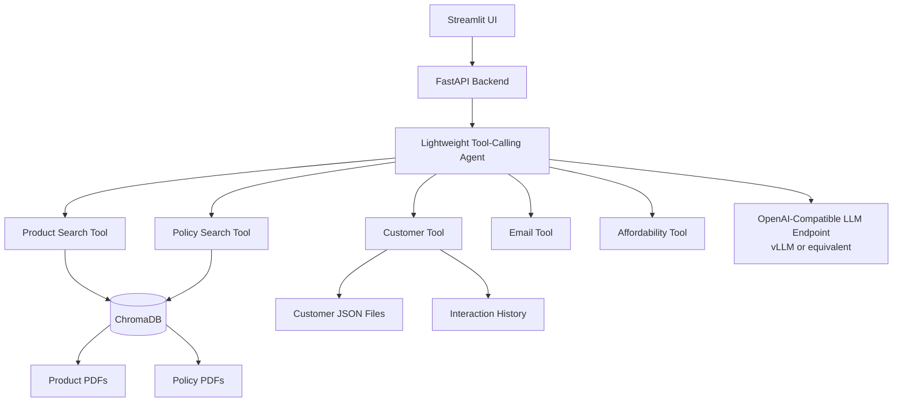

# Retail Banking Advisor Copilot

Retail Banking Advisor Copilot is a complete local demo of an enterprise AI assistant for retail banking advisors. It runs with a Streamlit UI, FastAPI backend, local JSON/PDF demo data, ChromaDB retrieval, deterministic banking tools, and an OpenAI-compatible LLM interface suitable for private vLLM deployments.

All customer profiles, product brochures, policies, and interaction histories are fictional and generated by scripts with fixed random seeds.

## Architecture



## What It Demonstrates

- Retrieval-Augmented Generation over product and policy PDFs
- OpenAI-compatible function/tool calling
- Customer profile and interaction analysis
- Product recommendations grounded in generated brochures
- Policy and compliance lookup with citations
- Professional follow-up email drafting
- Deterministic affordability assessment
- Private-environment operation with no authentication, authorization, SSO, RBAC, user management, or external SaaS dependency

## Project Structure

```text
app/
  api/
  agent/
  rag/
  tools/
  models/
  services/
  config/
frontend/
scripts/
data/
chroma_db/
Dockerfile
docker-compose.yml
requirements.txt
.env.example
startup.sh
README.md
```

## Local Development

```bash
python3.11 -m venv .venv
source .venv/bin/activate
pip install -r requirements.txt
cp .env.example .env
python scripts/generate_demo_data.py
python scripts/ingest_documents.py
uvicorn app.main:app --host 0.0.0.0 --port 8080
```

In another terminal:

```bash
source .venv/bin/activate
streamlit run frontend/streamlit_app.py --server.port 8501
```

Open:

- Streamlit: `http://localhost:8501`
- FastAPI OpenAPI docs: `http://localhost:8080/docs`

## Docker Deployment

Docker Compose uses the same strict remote-dependency behavior as Helm. Create a `.env` file with LLM, embedding, and ChromaDB settings before starting the stack:

```bash
cp .env.example .env
# Edit .env and provide remote LLM, embedding, and ChromaDB values.
docker compose up --build
```

Open the advisor UI at `http://localhost:8501`. FastAPI and OpenAPI docs are available at `http://localhost:8080/docs`.

Docker Compose runs the app as two containers using the versioned image tag `vinchar/retail-banking-copilot:0.1.7`:

- `backend`: FastAPI, data generation, Chroma indexing, tools, and agent runtime on port `8080`
- `frontend`: Streamlit advisor workspace on port `8501`

The compose file pins `platform: linux/amd64` so locally built and pulled containers match x86 server deployments.

The compose file persists:

- `demo_data` at `/app/data`
- `chroma_data` at `/app/chroma_db`

## Helm Deployment

The Helm chart is in `charts/retail-banking-copilot`.

Render the chart locally:

```bash
helm template retail-banking-copilot charts/retail-banking-copilot
```

Install and connect to an existing ChromaDB service:

```bash
helm upgrade --install retail-banking-copilot charts/retail-banking-copilot \
  --namespace banking-demo \
  --create-namespace \
  --set image.repository=vinchar/retail-banking-copilot \
  --set image.tag=0.1.7 \
  --set llm.baseUrl=https://qwen257b.project-public.serving.hpepcai3.demo.local \
  --set llm.model=Qwen/Qwen2.5-7B-Instruct \
  --set llm.apiKey=YOUR_LLM_TOKEN \
  --set embedding.baseUrl=https://all-mini-lm.project-public.serving.hpepcai3.demo.local \
  --set embedding.model=sentence-transformers/all-MiniLM-L6-v2 \
  --set embedding.apiKey=YOUR_EMBEDDING_TOKEN \
  --set chroma.mode=http \
  --set chroma.host=https://chroma-db.hpepcai3.demo.local/ \
  --set chroma.port=443 \
  --set chroma.ssl=true \
  --set ezua.virtualService.endpoint=retail-banking-copilot.${DOMAIN_NAME}
```

The packaged chart artifact is generated at `dist/retail-banking-copilot-0.1.7.tgz`.

The chart creates:

- App `Deployment` with separate backend and frontend containers
- FastAPI exposed on `8080` inside the pod
- Streamlit exposed on `8501`
- `Service` with Streamlit and API ports
- Optional Istio `VirtualService`
- Secret for `LLM_API_KEY` and `EMBEDDING_API_KEY`, or existing secret references
- PVC for generated demo data
- Optional local ChromaDB PVC only when `chroma.mode=persistent`

The chart does not deploy ChromaDB. Point `chroma.host`, `chroma.port`, `chroma.ssl`, `chroma.tenant`, and `chroma.database` at the ChromaDB service already running on your server.

## Configuration

Environment variables:

```bash
LLM_BASE_URL=
LLM_MODEL=
LLM_API_KEY=
ALLOW_LOCAL_LLM_FALLBACK=false
EMBEDDING_MODEL=
EMBEDDING_BASE_URL=
EMBEDDING_API_KEY=
ALLOW_LOCAL_EMBEDDING_FALLBACK=false
CHROMA_MODE=http
CHROMA_PATH=./chroma_db
CHROMA_HOST=
CHROMA_PORT=443
CHROMA_SSL=true
CHROMA_TENANT=default_tenant
CHROMA_DATABASE=default_database
ALLOW_LOCAL_CHROMA_FALLBACK=false
DATA_PATH=./data
RUNTIME_SETTINGS_PATH=./data/config/runtime_settings.json
LOAD_PERSISTED_RUNTIME_SETTINGS=false
API_BASE_URL=http://localhost:8080
```

The repository does not commit bearer tokens. Set `LLM_API_KEY` and `EMBEDDING_API_KEY` through `.env`, Helm values, existing Kubernetes secrets, or the Settings tab.

ChromaDB can run in two modes:

- `CHROMA_MODE=persistent`: embedded ChromaDB client writes to `CHROMA_PATH`.
- `CHROMA_MODE=http`: app connects to a ChromaDB server using `CHROMA_HOST`, `CHROMA_PORT`, `CHROMA_SSL`, `CHROMA_TENANT`, and `CHROMA_DATABASE`.

External LLM, ChromaDB, and embeddings are required. The application does not fall back to local LLM responses, local embeddings, or local ChromaDB unless you explicitly override the fallback flags yourself.

`LOAD_PERSISTED_RUNTIME_SETTINGS=false` keeps deployment values and Kubernetes secrets as the source of truth after pod restarts.

The Streamlit app also includes a `Settings` tab where you can update these runtime values without rebuilding the container:

- ChromaDB path
- ChromaDB mode, host, port, SSL, tenant, and database
- Embedding model
- Embedding endpoint
- Embedding token
- LLM endpoint
- LLM model name
- LLM token
- LLM timeout

Settings changed in the UI are applied to the running FastAPI process and persisted to `RUNTIME_SETTINGS_PATH`. In Docker this defaults to `/app/data/config/runtime_settings.json`, which is stored in the `demo_data` volume. In Helm this path is mounted on the data PVC.

Tokens are saved in that local settings file when you enter them, but they are never returned to the browser. Leaving a token field blank keeps the existing token. After changing the embedding model, embedding endpoint, ChromaDB mode, or ChromaDB location, click `Reindex documents` in the Settings tab to rebuild the product and policy collections.

## HPE Private Cloud AI Deployment Notes

Use vLLM or another OpenAI-compatible inference server inside the private environment and point `LLM_BASE_URL` at its `/v1` endpoint. The model name is configured with `LLM_MODEL`, so the same app can target Qwen, Llama, Mistral, or another internally approved model.

For air-gapped deployment, pre-stage Python wheels, the sentence-transformers embedding model, and any vLLM model weights in the private artifact registry or image build context. The app itself does not require SaaS services at runtime.

For scaling, run FastAPI and Streamlit as separate services behind internal routing, mount a persistent ChromaDB volume or replace ChromaDB with an approved managed vector service, and scale the OpenAI-compatible model endpoint independently from the application tier.

## Demo Data

Generate data:

```bash
python scripts/generate_demo_data.py
```

Expected output:

```text
Generated:
- 50 customers
- 8 product brochures
- 5 policy documents
- 400 interactions
```

Rebuild retrieval indexes:

```bash
python scripts/ingest_documents.py
```

## API

- `POST /chat`
- `GET /customers`
- `GET /customer/{id}`
- `GET /customer/{id}/interactions`
- `GET /settings`
- `PUT /settings`
- `POST /reindex`
- `GET /health`

OpenAPI documentation is available at `/docs`.

## Example Prompts

- `Summarize customer 001`
- `Customer 014 wants a EUR 30,000 personal loan. What should I recommend?`
- `What lending policy applies?`
- `Draft a follow-up email.`
- `Summarize recent customer interactions.`
- `Is this customer likely to qualify for an auto loan?`
=======
